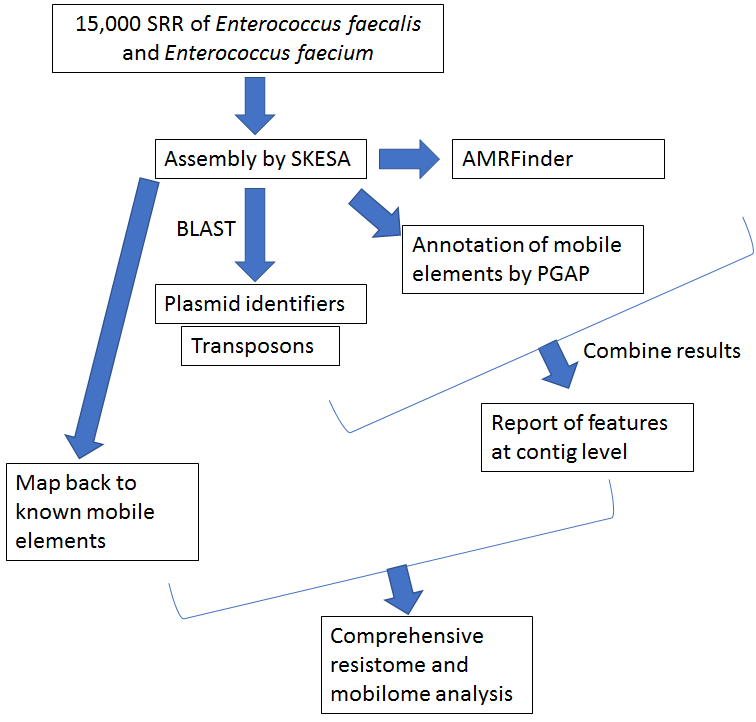
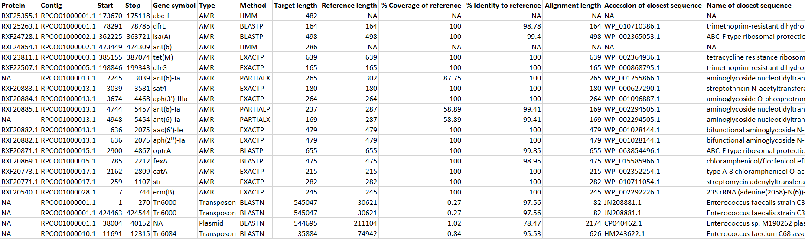

## Purpose

To develop a tool for tracking AMR genes in mobile elements, using enterococci as an example.

## Workflow

## Implementation

We ran a modified version of AMRFinder designed to identify mobile elements from a custom database. An example from a report from the analysis is listed below.

## Mock report

## Future directions

Incorporate tool into NCBI Pathogen Detection Pipeline, and expand to additional bacterial genera. In addition, we hope to expand and improve the mobile element databases on which this tool relies.
